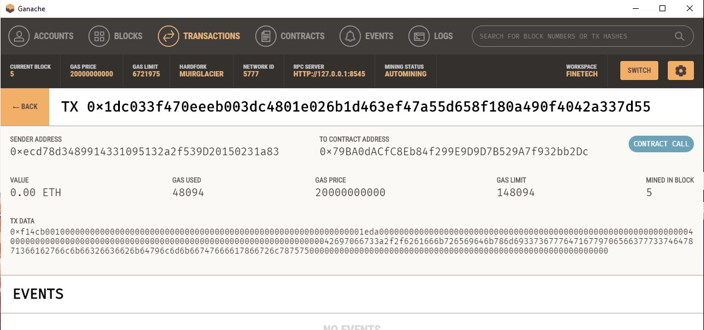

# Unit 20 - "Looks like we've made our first contract!"

## Background

Your new startup has created its own Ethereum-compatible blockchain to help connect financial institutions, and the team wants to build smart contracts to automate some company finances to make everyone's lives easier, increase transparency, and to make accounting and auditing practically automatic.

Fortunately, you've been learning how to program smart contracts with Solidity! What you will be doing this assignment is creating 3 `ProfitSplitter` contracts. These contracts will do several things:

* Pay your associate-level employees quickly and easily.

* Distribute profits to different tiers of employees.

* Distribute company shares for employees in a "deferred equity incentive plan" automatically.

## Files

* [`AssociateProfitSplitter.sol`](Starter-Code/AssociateProfitSplitter.sol) — Level 1 starter code.

* [`TieredProfitSplitter.sol`](Starter-Code/TieredProfitSplitter.sol) — Level 2 starter code.

* [`DeferredEquityPlan.sol`](Starter-Code/DeferredEquityPlan.sol) — Level 3 starter code.

# AssociateProfitSplitter

This contract will accept Ether into the contract, and divide it evenly among associate-level employees. This will allow the human resources department to pay employees quickly and efficiently. Below is a screenshot of the contract.

## Deployment and recieved

Address Info

employee_one address is 0x9a30195c09A3854D8764cAd52C51c1Fc5c52e473

employee_two address is 0x600642801aCa779C9D03661a7eC6d8Eb97A8A527

employee_three address is 0xF569F337b8204Bdc82D2A17331FF59B8c883B98D

3 ether will be deposit to those 3 addresses

## Confirm Deployment recieved in Meta Mask

## Transaction Process

## Sending Deposit and Confirmation

## Deposit

## Contract Call Confirmed

## Transaction Complete

